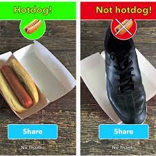

# food-not-food

Machine Learning powered app to decide whether a photo is food or not.

## TODO
* Cleanup data download
* Make model better
* Fix output predict probability
* Make way to say whether model was correct or not (log this somewhere)

See notes on Notion: https://www.notion.so/mrdbourke/November-6-100k-Livestream-Celebration-a6ed0836c7a9490f94ada8891e606d8e

What we're building (except for food not food):

## Dataset

Want to build a dataset of 10,000~ food and 10,000~ not food images (these numbers can go up if needed).

* Food images = food-5k + Food101 (random subset)
* Not images = food-5k + Open Images (random subset + filtering for not food images)

**Food-5k (2500 images of food and 2500 images of not food)**
* Downloaded data from Food not food on Kaggle (food images are prefixed with `1` e.g. `1_340.jpg` and not food images are prefixed with `0`) - https://www.kaggle.com/binhminhs10/food5k 
* Extract files from food5k into `food_images` and `not_food_images` using `extract_food_5k.py` (note: this disregards the original train/eval/test splits of food5k)

**Open Images**
* Installed FiftyOne to download images from Open Images - `pip install fiftyone`
* Following this guide to download a random subset of images - https://voxel51.com/docs/fiftyone/tutorials/open_images.html
* Downloaded ~100 sample images from Open Images using `download_open_images.py` using `seed=42`
* **Next:** Figure out how to sort through Open Images data and then create a dataset of random images from Open Images into `not_food_images`